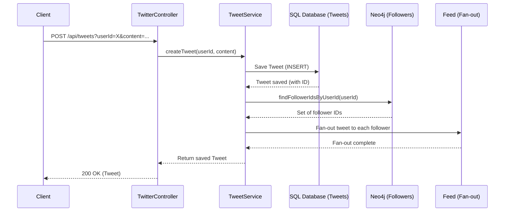
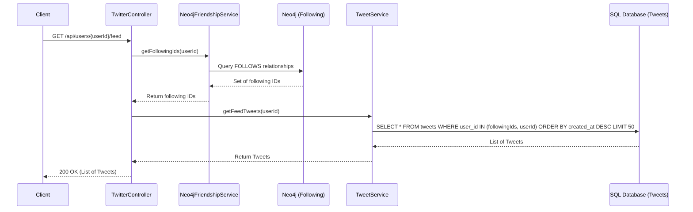
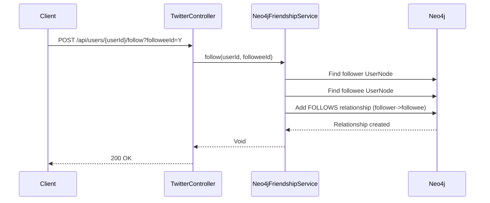

# Diagrams

## Feed Flow Sequence Diagram

### Tweet Creation with Fan-out

```mermaid
sequenceDiagram
    participant Client
    participant Controller as TwitterController
    participant TweetService
    participant SQL as SQL Database (Tweets)
    participant Neo4j as Neo4j (Followers)
    participant Feed as Feed (Fan-out)

    Client->>Controller: POST /api/tweets?userId=X&content=...
    Controller->>TweetService: createTweet(userId, content)
    TweetService->>SQL: Save Tweet (INSERT)
    SQL-->>TweetService: Tweet saved (with ID)
    TweetService->>Neo4j: findFollowerIdsByUserId(userId)
    Neo4j-->>TweetService: Set of follower IDs
    TweetService->>Feed: Fan-out tweet to each follower
    Feed-->>TweetService: Fan-out complete
    TweetService-->>Controller: Return saved Tweet
    Controller-->>Client: 200 OK (Tweet)
```

### Feed Retrieval

```mermaid
sequenceDiagram
    participant Client
    participant Controller as TwitterController
    participant Neo4jService as Neo4jFriendshipService
    participant Neo4j as Neo4j (Following)
    participant TweetService
    participant SQL as SQL Database (Tweets)

    Client->>Controller: GET /api/users/{userId}/feed
    Controller->>Neo4jService: getFollowingIds(userId)
    Neo4jService->>Neo4j: Query FOLLOWS relationships
    Neo4j-->>Neo4jService: Set of following IDs
    Neo4jService-->>Controller: Return following IDs
    Controller->>TweetService: getFeedTweets(userId)
    TweetService->>SQL: SELECT * FROM tweets WHERE user_id IN (followingIds, userId) ORDER BY created_at DESC LIMIT 50
    SQL-->>TweetService: List of Tweets
    TweetService-->>Controller: Return Tweets
    Controller-->>Client: 200 OK (List of Tweets)
```

### Follow/Unfollow Flow

```mermaid
sequenceDiagram
    participant Client
    participant Controller as TwitterController
    participant Neo4jService as Neo4jFriendshipService
    participant Neo4j as Neo4j

    Client->>Controller: POST /api/users/{userId}/follow?followeeId=Y
    Controller->>Neo4jService: follow(userId, followeeId)
    Neo4jService->>Neo4j: Find follower UserNode
    Neo4jService->>Neo4j: Find followee UserNode
    Neo4jService->>Neo4j: Add FOLLOWS relationship (follower->followee)
    Neo4j-->>Neo4jService: Relationship created
    Neo4jService-->>Controller: Void
    Controller-->>Client: 200 OK
```
