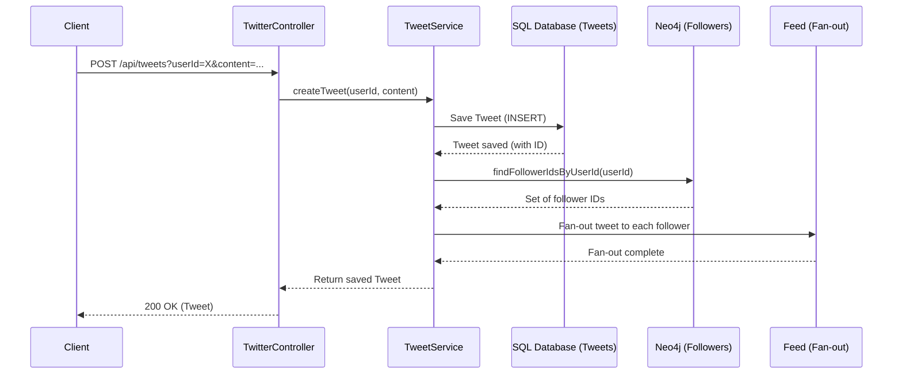
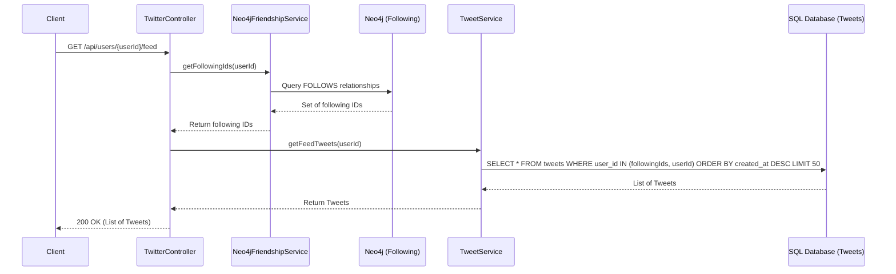
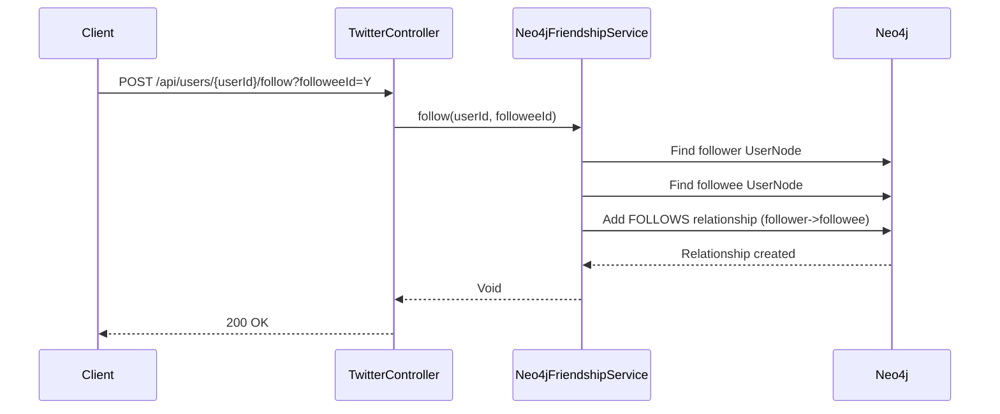
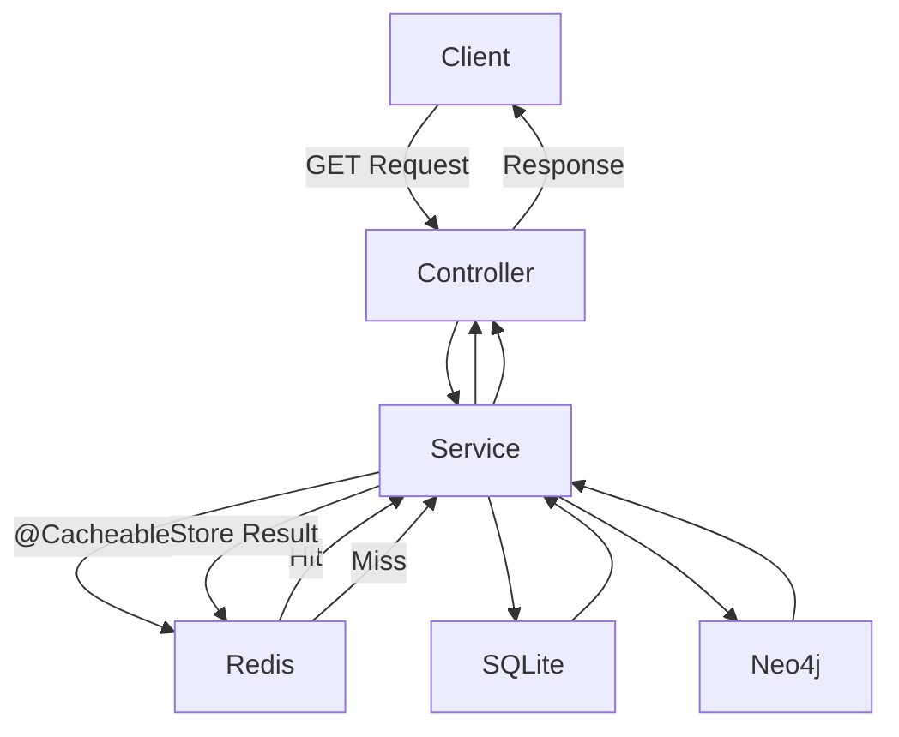
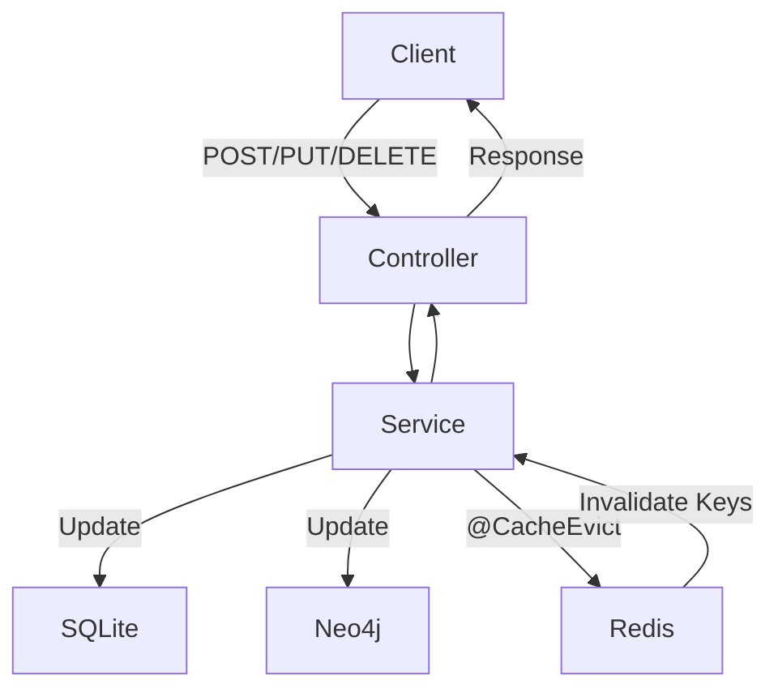
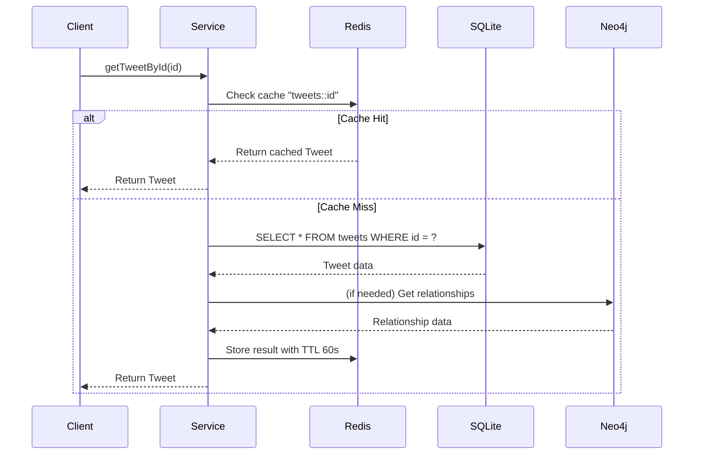
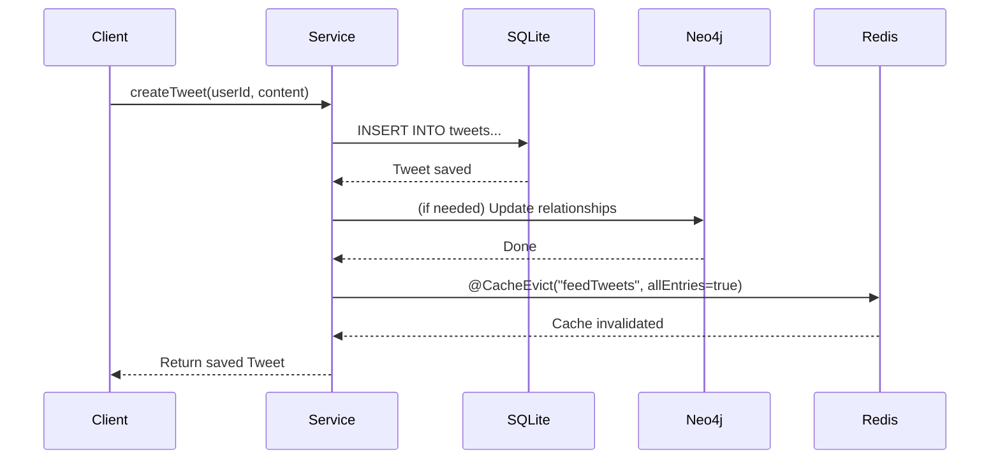

# Diagrams

## Components Overview
| Component | Role | Connection |
|-----------|------|------------|
| **SQLite** | Relational data (users, tweets, likes, comments) | `./.local/data/twitterlike.db` (JDBC) |
| **Neo4j** | Graph relationships (user follows) | `bolt://localhost:7687` (Spring Data Neo4j) |
| **Redis** | Hot read cache (60s TTL) | `localhost:6379` (Spring Data Redis) |

## Feed Flow Sequence Diagrams

### Tweet Creation with Fan-out

### Feed Retrieval

### Follow/Unfollow Flow

## Cache Flow Diagrams

### Read Flow (Cached)

### Write Flow (Cache Eviction)

### Cache Read Sequence

### Cache Write Sequence

## Cache Details
- **Cached Data**: Tweets, users, like counts, user feeds (see `application.yml` for full cache names)
- **TTL**: 60 seconds (60000ms)
- **Eviction**: Triggered on all write operations (create/update/delete) to maintain consistency
- **Null Caching**: Disabled to avoid caching missing data

## Database Interaction Summary
1. **Relational Data**: Users, tweets, likes, comments → SQLite via JPA
2. **Graph Data**: User follow relationships → Neo4j via Spring Data Neo4j
3. **Hot Reads**: Frequently accessed data → Redis (with fallback to DB on miss)
4. **Feed Generation**: Uses Neo4j to fetch following IDs, then queries SQLite for tweets (result cached in Redis as `feedTweets`)
